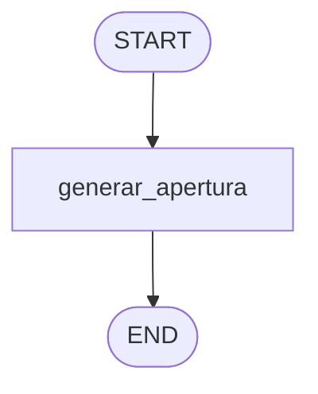

# Clase 1 — Fundamentos de prompting (tu primer grafo)

Primera clase del curso. Aquí montamos la base de todo lo que viene: cómo se le
pide algo a un modelo, cómo obtener una salida **estructurada y validada**, y
cómo envolver eso en tu **primer grafo de LangGraph**.

## Qué vas a aprender

1. **System prompt vs user prompt.** La diferencia entre instruir al modelo
   (system) y darle el caso concreto (human).
2. **Zero-shot vs prompting basado en rol.** Comparas el modo `baseline`
   (instrucción mínima) contra el modo `role` (ROL + VALORES + RESTRICCIONES) y
   ves el efecto en la calidad.
3. **Salida estructurada con Pydantic.** En vez de leer texto suelto, el modelo
   devuelve un objeto `AperturaCoqueta` validado (`schemas.py`).
4. **LCEL.** Encadenas `prompt | llm.with_structured_output(Schema)`.
5. **LangGraph mínimo.** Un grafo de un solo nodo: `START → generar_apertura → END`.

## El grafo



## Estructura del código

Mantenemos cada responsabilidad en su archivo (igual que en producción):

| Archivo        | Responsabilidad                                          |
| -------------- | -------------------------------------------------------- |
| `logger.py`    | Logger con colores reutilizable.                         |
| `settings.py`  | Carga del `.env` y fábrica del LLM (perezosa + cacheada). |
| `schemas.py`   | Contratos de datos (Pydantic).                           |
| `prompts.py`   | Los dos system prompts a comparar.                       |
| `graph.py`     | El grafo de LangGraph y el nodo. Exporta `graph`.        |
| `main.py`      | CLI para ejecutarlo desde la terminal.                   |

## Cómo ejecutarlo

Necesitas una `OPENAI_API_KEY` en `course1_prompt_engineering/.env` (o en un
`.env` dentro de esta carpeta; mira `.env.example`).

```bash
# 1. Crear el entorno e instalar dependencias
uv sync

# 2a. Ejecutar desde la terminal
uv run python main.py -p "Le gusta el cine de los 90 y correr maratones"
uv run python main.py -p "Toca jazz los fines de semana" --modo baseline

# 2b. Ejecutar en LangGraph Studio (visual, interactivo)
uv run langgraph dev
```

`langgraph dev` abre un servidor local y la interfaz de LangGraph Studio, donde
ves el grafo dibujado y puedes invocarlo cambiando el estado de entrada
(`perfil`, `modo`) a mano.

## Experimento sugerido

Lanza el mismo `perfil` con `--modo baseline` y con `--modo role`. Compara las
dos aperturas: el modo `role` debería sonar más natural, respetuoso y conectado
con el perfil. Esa diferencia, sin cambiar el modelo, es **todo el poder del
prompting**.
