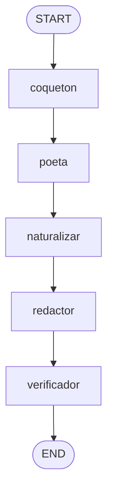

# Clase 2 — Prompt Chaining (cadena de especialistas)

En la clase 1 usamos un solo prompt. Aquí damos el siguiente paso: descomponer
una tarea en **varios pasos pequeños y especializados**, donde la salida de cada
paso es la entrada del siguiente.

## La cadena



| Nodo          | Responsabilidad única              | Temperatura |
| ------------- | ---------------------------------- | ----------- |
| `coqueton`    | Idea base para romper el hielo     | 0.8 (creativo) |
| `poeta`       | Darle un toque evocador            | 0.7 |
| `naturalizar` | Quitar la cursilería               | 0.3 |
| `redactor`    | Dejar el mensaje listo para enviar | 0.5 |
| `verificador` | Control de calidad (salida Pydantic) | 0.0 (determinista) |

## Por qué hacerlo así

- **Calidad:** cada paso tiene una sola tarea fácil de hacer bien.
- **Control:** ajustas la temperatura por etapa (creatividad arriba, control abajo).
- **Trazabilidad:** el estado guarda TODOS los pasos intermedios, así puedes ver
  exactamente dónde mejora (o empeora) el mensaje.

El último nodo, `verificador`, devuelve un objeto Pydantic `Veredicto`
(`aprobado: bool`, `observaciones: str`): cuando necesitas decidir algo en código,
pides salida estructurada, no texto libre.

## Cómo ejecutarlo

```bash
uv sync

# Desde la terminal (imprime los 5 pasos)
uv run python main.py -c "Le gusta el senderismo y los documentales de naturaleza"

# En LangGraph Studio (ves la cadena dibujada paso a paso)
uv run langgraph dev
```

## Experimento sugerido

Abre `langgraph dev` y observa el estado después de cada nodo. Fíjate cómo el
mensaje pasa de "idea cruda" a "poético" a "natural" a "final". Ese recorrido
visible es justo lo que hace al chaining tan fácil de depurar.
