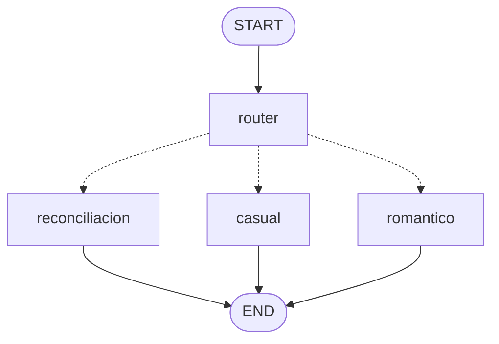

# Clase 3 — Routing (despacho a especialistas)

Hasta ahora todos los caminos eran fijos. Aquí el grafo **decide en tiempo de
ejecución** a dónde ir, según la intención del usuario.

## El grafo



| Nodo            | Qué hace                                          | Temperatura |
| --------------- | ------------------------------------------------- | ----------- |
| `router`        | Clasifica la intención → `ruta` (salida Pydantic) | 0.0 (estable) |
| `reconciliacion`| Mensaje empático que asume responsabilidad        | 0.3 |
| `casual`        | Plan ligero, con humor y sin presión              | 0.8 |
| `romantico`     | Declaración intensa pero elegante                 | 0.9 |

## La pieza nueva: `add_conditional_edges`

En las clases anteriores usábamos `add_edge(a, b)` (arista fija). Aquí usamos:

```python
workflow.add_conditional_edges("router", elegir_ruta, {
    "reconciliacion": "reconciliacion",
    "casual": "casual",
    "romantico": "romantico",
})
```

`elegir_ruta(state)` lee el estado y devuelve una clave; el diccionario la
traduce al nodo destino. El router primero **clasifica** (con salida estructurada
`RutaDecision`, así la ruta siempre es uno de los valores válidos) y luego el
grafo despacha.

## Por qué importa

- **Calidad:** cada intención recibe un prompt afinado, no uno genérico.
- **Coste/latencia:** mandas cada caso al camino más corto y suficiente.

## Cómo ejecutarlo

```bash
uv sync

uv run python main.py -p "Quiero disculparme por haber llegado tarde a la cita"
uv run python main.py -p "Me gustaría invitarla a un café sin presión"
uv run python main.py -p "Quiero confesarle que llevo meses pensando en ella"

uv run langgraph dev   # ver el routing dibujado
```

## Experimento sugerido

Lanza las tres peticiones de arriba y comprueba que cada una cae en una ruta
distinta. Luego prueba una petición ambigua y observa cómo el router justifica
su decisión en `razon_ruta`.
