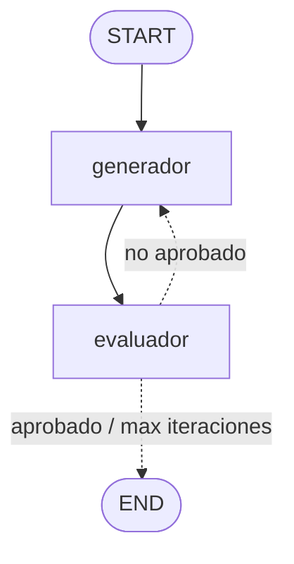

# Clase 4 — Evaluator-Optimizer (el patrón estrella)

La clase final junta todo: un **ciclo** donde un modelo escribe y otro lo
critica, hasta alcanzar una calidad medible. Es el patrón que usan los sistemas
serios para mejorar sus propias salidas.

## El ciclo



| Rol         | Qué hace                                                | Temperatura |
| ----------- | ------------------------------------------------------- | ----------- |
| `generador` | Escribe / reescribe el borrador (con razonamiento CoT)  | 0.7 |
| `evaluador` | Puntúa con la rúbrica y da feedback (salida Pydantic)   | 0.0 (juez consistente) |

El bucle se repite hasta que:
- el **promedio** de la rúbrica supera el `umbral` (aprobado), **o**
- se agotan las `max_iteraciones` (cortafuegos contra bucles y coste).

## La rúbrica (LLM-as-judge)

El evaluador devuelve un objeto `Evaluacion` con 4 criterios ortogonales (0-10):

- **personalizacion** — ¿usa señales del perfil?
- **naturalidad** — ¿suena humano?
- **respeto** — ¿sin presión ni nada inapropiado?
- **accionable** — ¿invita a responder?

> Mejora respecto al material original: aquí el juez es el propio modelo con
> criterios explícitos, en lugar de reglas/regex frágiles. El **promedio** se
> calcula en código (`Evaluacion.promedio`), no se lo pedimos al modelo.

## Conceptos nuevos de LangGraph

1. **Ciclo real:** una arista condicional que vuelve a un nodo anterior
   (`evaluador → generador`).
2. **Reducer `operator.add`:** el campo `historial` se *acumula* en cada vuelta
   en lugar de sobrescribirse. Así guardamos la traza de todas las iteraciones.

## Cómo ejecutarlo

```bash
uv sync

uv run python main.py -c "Le apasiona la astronomía y hornear pan"
uv run python main.py -c "Toca el chelo" --umbral 9 --max-iteraciones 4

uv run langgraph dev   # ver el ciclo iterar en vivo
```

## Experimento sugerido

Sube el `--umbral` a 9.5 y observa cómo el generador necesita más vueltas (y a
veces no llega: ahí entra el tope de iteraciones). Mira el `historial`: el
puntaje debería subir vuelta a vuelta a medida que el generador ataca el feedback.
Eso es **mejora medible y automática**.
