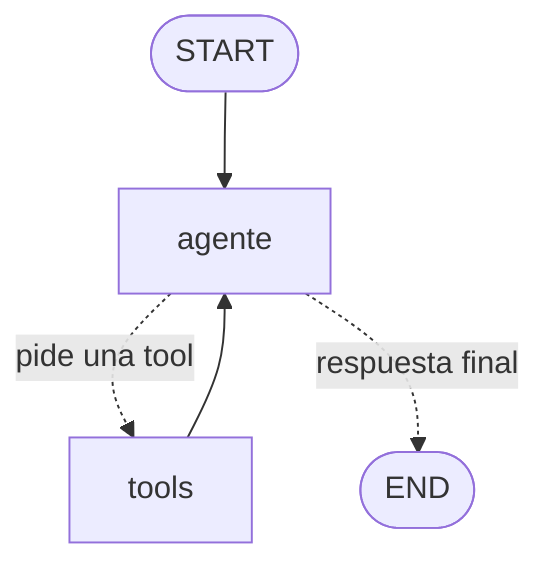

# Clase 5 — ReAct (agente con herramientas)

En las clases 1-4 nosotros decidíamos el flujo (lineal, ramas, ciclo). En ReAct
es el **modelo** quien decide, paso a paso, qué hacer: razona, llama a una
herramienta, observa el resultado y repite hasta tener la respuesta.

ReAct = **Rea**soning + **Act**ing.

## El grafo



| Pieza             | Qué hace                                                       |
| ----------------- | -------------------------------------------------------------- |
| `agente`          | El LLM con herramientas enlazadas (`bind_tools`); razona y decide. |
| `tools`           | `ToolNode`: ejecuta las herramientas que el agente pidió.      |
| `tools_condition` | Decide si volver a `tools` o terminar (función prefabricada).  |

El bucle `agente → tools → agente` es el corazón de ReAct.

## Las herramientas (`tools.py`)

Tres herramientas **deterministas** (sin LLM dentro), cada una con un contrato
claro (type hints + docstring que el modelo lee):

- `analizar_perfil(perfil)` — detecta intereses y tono.
- `sugerir_plan(interes)` — propone un plan concreto desde un catálogo.
- `auditar_respeto(mensaje)` — guardrail: valida que el mensaje sea respetuoso
  y breve antes de enviarlo.

> Idea clave: el modelo **razona**, pero delega los **hechos** en herramientas
> fiables. No le pedimos que invente lo que una tool puede resolver con certeza.

## Cómo ejecutarlo

```bash
uv sync

# Con --traza ves cada paso: pensamiento, acción y observación
uv run python main.py -p "Le gusta el cine de autor y los vinilos" --traza

uv run langgraph dev   # ver el bucle ReAct dibujado
```

## Cinturón de seguridad

Un agente puede entrar en bucle. Por eso `main.py` pasa `recursion_limit=12`:
si el agente no concluye en esos pasos, LangGraph corta. En producción esto es
obligatorio (límite de pasos + manejo de errores de tools).

## Cuándo usar ReAct (y cuándo no)

- **Úsalo** cuando la tarea necesita decidir sobre la marcha qué información
  buscar o qué acción tomar (varias herramientas, caminos no fijos).
- **No lo uses** si un flujo fijo (clases 1-4) ya resuelve el problema: ReAct es
  más caro (varias llamadas al modelo) y menos predecible.

## Siguiente paso

Cuando entiendas este agente, abre `RETO.md`: un desafío profundo para construir
tu propio agente ReAct de nivel producción, juntando todo lo del curso.
