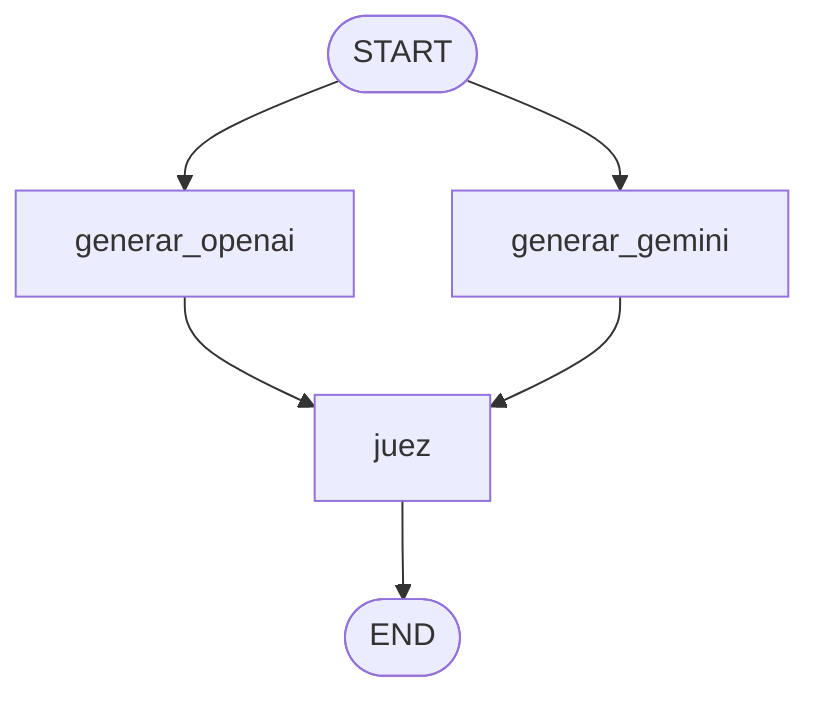

# Bonus — Comparativa OpenAI vs Gemini (con LLM-juez)

Módulo extra del curso. Responde a una pregunta muy real en AI Engineering:
*¿qué modelo lo hace mejor para mi tarea?* En vez de decidirlo "a ojo",
generamos la misma salida con dos proveedores y dejamos que un **LLM imparcial**
los puntúe y elija.

## El grafo



| Nodo             | Qué hace                                                    |
| ---------------- | ----------------------------------------------------------- |
| `generar_openai` | Genera la apertura con OpenAI (`gpt-4o-mini`).              |
| `generar_gemini` | Genera la apertura con Gemini (`gemini-2.0-flash`).        |
| `juez`           | Un LLM imparcial puntúa ambas (0-10) y declara un ganador.  |

Los dos generadores corren **en paralelo** (fan-out) y el `juez` espera a los
dos (fan-in). Ambos usan el MISMO prompt: así comparamos los modelos, no dos
prompts distintos.

## Dos ideas de AI Engineering que enseña

1. **Abstracción de proveedor.** `settings.get_llm(provider="openai" | "gemini")`
   devuelve un modelo con la misma interfaz de LangChain. El resto del código no
   cambia: cambiar de modelo es cambiar un string.
2. **LLM-as-judge para A/B testing.** El veredicto lo da y lo devuelve un LLM en
   formato estructurado (`Veredicto`: ganador, puntajes y justificación), no una
   opinión informal.

## Requisitos

En `course1_prompt_engineering/.env` necesitas DOS claves:

```
OPENAI_API_KEY=sk-...
GEMINI_API_KEY=AIza...    # de Google AI Studio (también vale GOOGLE_API_KEY)
```

> La key de Gemini debe estar activa en https://aistudio.google.com/apikey y
> con la "Generative Language API" habilitada. Si Google responde
> `API_KEY_INVALID`, regenera la clave allí.
>
> Nota de cuota (free tier): no todos los modelos tienen cuota gratuita. En las
> pruebas, `gemini-2.0-flash` devolvía `429` con `limit: 0`, mientras que
> `gemini-2.5-flash` sí responde. Por eso es el modelo por defecto en
> `settings.py`. Si te topas con `RESOURCE_EXHAUSTED`, cambia el modelo o espera.

> El juez usa OpenAI. Si quieres un juez 100% neutral, puedes cambiarlo en
> `graph.py` por un tercer modelo distinto a los dos comparados.

## Cómo ejecutarlo

```bash
uv sync

uv run python main.py -p "Le gusta el cine de los 90 y correr maratones"

uv run langgraph dev   # ver los dos generadores en paralelo y el juez
```

## Experimento sugerido

Lanza varios perfiles y anota quién gana. ¿Hay un patrón? Quizá un modelo es más
natural y el otro más creativo. Esa observación —respaldada por puntajes, no por
intuición— es exactamente el tipo de decisión que toma un AI Engineer.
